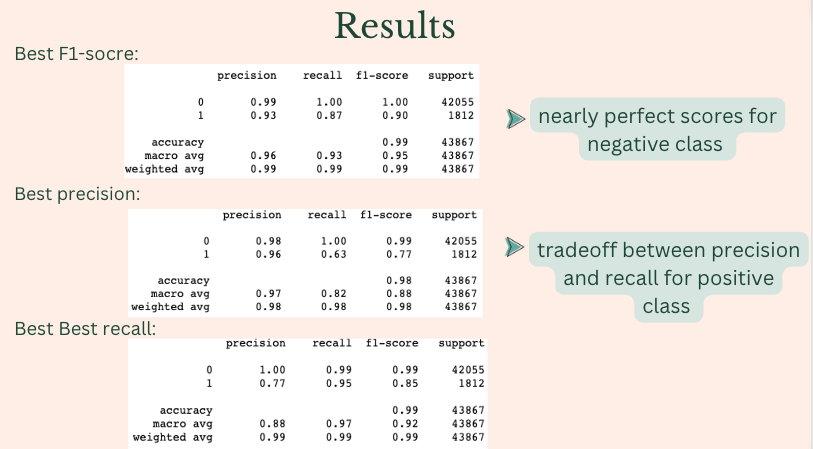

# Capstone-2-Domestic-Violence-Detection
### Do you know that 1 in 4 women and 1 in 7 men have been victims of severe physical violence by an intimate partner? And more than 1 in 3 women and 1 in 4 men have experienced either physical violence, rape, or stalking by an intimate partner in their lifetime? 

Those are staggering numbers that many people aren’t aware of. One of the biggest reasons is that victims often don’t talk about it with friends and family, instead many of them go online to search for answers or just to tell their stories and pour out their feelings. That’s why social media plays a major role to provide support and resources for victims. For instance, prompt national help hotline, nearby support groups, shelters, etc. 

This project focus on detecting domestic violence posts. 

This project also experiented with varous ways to deal with imbanlanced dataset. The comprehensive summarization is recorded in the last section of [documentation](https://github.com/EmmaDu640/Capstone-2-Domestic-Violence-Detection/blob/main/Documentation.pdf). Here is a sneak peak:

Please see a summary of findings and explanation of methodoligical judgements in the [presentation](https://github.com/EmmaDu640/Capstone-2-Domestic-Violence-Detection/blob/main/Presentation.pdf) page. 

[Notebook 1](https://github.com/EmmaDu640/Capstone-2-Domestic-Violence-Detection/blob/main/1-Data%20Collection%20(getting%20reddit%20posts%20using%20psaw).ipynb) demonstrates how the dataset is pulled from reddit via psaw.
[Notebook 2](https://github.com/EmmaDu640/Capstone-2-Domestic-Violence-Detection/blob/main/2-Data%20Wrangling%20%26%20EDA%20.ipynb) is the data wragling, Exploratory Data Analysis, and feature engineering.

In [Notebook 3](https://github.com/EmmaDu640/Capstone-2-Domestic-Violence-Detection/blob/main/3-NLP%20preprocessing.ipynb) the following NLP preprocessing was done:
  * Convert emojis to text
  * Using language-detection library langdetect to detect and remove non-English texts
  * Remove stopwords
  * clean and tokenize text
  *	Lemmatization

In [notebook 4](https://github.com/EmmaDu640/Capstone-2-Domestic-Violence-Detection/blob/main/4-Topic%20Modeling%20with%20Gensim%20.ipynb) and [notebook 5](https://github.com/EmmaDu640/Capstone-2-Domestic-Violence-Detection/blob/main/5-Topic%20Modeling%20with%20Scikit-learn.ipynb), topic modeling was conducted to explore if there are latent sementic differrence betwwen domestic violence posts and non domestic violence posts.

In [notebook 6](https://github.com/EmmaDu640/Capstone-2-Domestic-Violence-Detection/blob/main/6-Machine%20Leaning%20Modeling%20with%20scikit-learn.ipynb), tradition machine learning algorithms paired with differrent methods that combat imbalanced datasetare were experimented. Algorithmslogistic regression, random forest, naive bayes, svm and XGBoost. 

In [notebook 7](https://github.com/EmmaDu640/Capstone-2-Domestic-Violence-Detection/blob/main/7-LSTM%20modeling.ipynb), LSTM models are experimented. Here is the PRC comparision:

In [notebook 8](https://github.com/EmmaDu640/Capstone-2-Domestic-Violence-Detection/blob/main/8-Augmented%20vs%20Unaugmented%20LSTM%20Model%20Comparison.ipynb), text augmentation was implemented using nlpaug library, here is the prc comparison Augmented vs Unaugmented

Best performing models evaluation scores:

